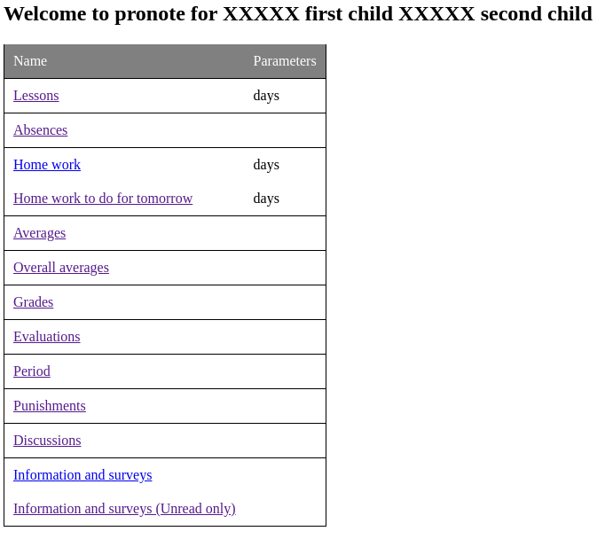

# pronote-rest

Providing rest api to get data from pronote

using https://github.com/bain3/pronotepy


docker : https://hub.docker.com/r/bdbogjoe/pronote-rest


# using docker compose :
```
version: "3"
services:
    pronote-rest:
        container_name: pronote-rest
        image: bdbogjoe/pronote-rest:master
        restart: unless-stopped
        ports:
            - 5000:5000
        volumes:
            - ./config:/home/app/config
```

# using docker :
```
docker run -p 5000:5000 -v $(pwd)/config:/home/app/config bdbogjoe/pronote-rest:master
```

# Go to home page to get list of end points:
```
http://localhost:5000
```

